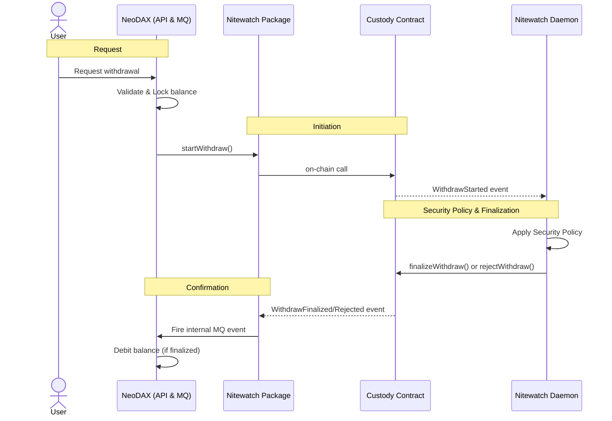

# Nitewatch

Nitewatch is a package used by **NeoDAX** to interact with an EVM on-chain custody contract through the `ICustody` interface. It provides the security policy engine and the infrastructure to manage deposits and withdrawals.

NeoDAX utilizes the Nitewatch package to run two primary processes:
1.  **Event Daemon**: Produces `ICustody` events by listening to the blockchain and pushing them to an internal Message Queue (MQ).
2.  **Contract Interface**: An implementation to call smart-contract methods (e.g., starting or finalizing withdrawals).

## Stack

- **Smart Contracts**: Solidity (Forge)
- **Backend**: Go
- **Blockchain**: EVM-compatible chains

## Features

### Deposits

1.  User deposits native ETH or ERC20 tokens into the custody contract via a frontend dApp.
2.  The **Event Daemon** detects the on-chain event.
3.  An internal event is fired to the NeoDAX MQ.
4.  NeoDAX credits the user's balance.

### Withdrawals

Withdrawals are governed by a security policy engine that tracks per-user and global limits (hourly/daily).

1.  User requests a withdrawal via the NeoDAX Web API.
2.  NeoDAX validates the request internally and locks the user's balance.
3.  NeoDAX uses the Nitewatch package to call `startWithdraw` on the custody contract.
4.  The **Nitewatch Daemon** listens for the `WithdrawStarted` event, applies the security policy, and then either calls `finalizeWithdraw` or `rejectWithdraw`.
5.  The **Event Daemon** waits for the outcome (`WithdrawFinalized` or `WithdrawRejected`), fires an internal event, and NeoDAX debits the balance upon successful confirmation.

## Flows

### Withdrawal Flow

