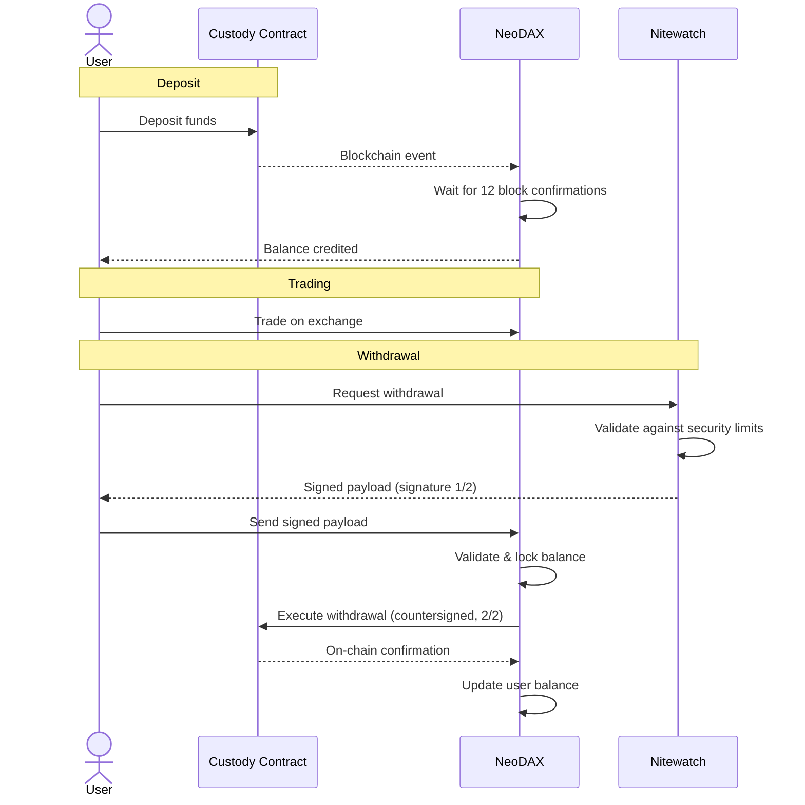

# NeoDAX Gateway

NeoDAX Gateway is a micro-service interacting with an EVM on-chain custody contract through the `ICustody` interface. Users can deposit and withdraw funds for the Yellow Network.

The custody is multi-sig.

## Stack

- **Smart Contracts**: Solidity (Forge)
- **Backend**: Go
- **Blockchain**: EVM-compatible chains (first version)

## Features

### Deposits

Users can deposit from a frontend dApp into the custody contract:

- **ETH** (native)
- **ERC20 tokens**

### Withdrawals

Users can withdraw funds by collecting 2/3 signatures on their withdrawal request. Two separate micro-services process the withdrawal request payload with independent logic:

- **NeoDAX Custody Adapter** — Verifies and locks the user balance, with a release mechanism (rollback if the withdrawal expires).
- **Nitewatch** — Deployed in a high-security isolated environment. Tracks per-user hourly/daily limits and global hourly/daily limits (a security policy engine).

## Withdrawal Flow

1. User deposits funds into the custody contract.
2. NeoDAX listens to blockchain events and waits for 12 block confirmations before publishing a deposit event to the message queue.
3. User can trade on the exchange.
4. User requests a withdrawal of a single asset. **Nitewatch** validates the request against security limits and signs the payload.
5. User sends the signed payload to **NeoDAX**. NeoDAX validates, locks the balance, countersigns, and executes the withdrawal on the smart contract.
6. NeoDAX updates the user balance after on-chain confirmation.

