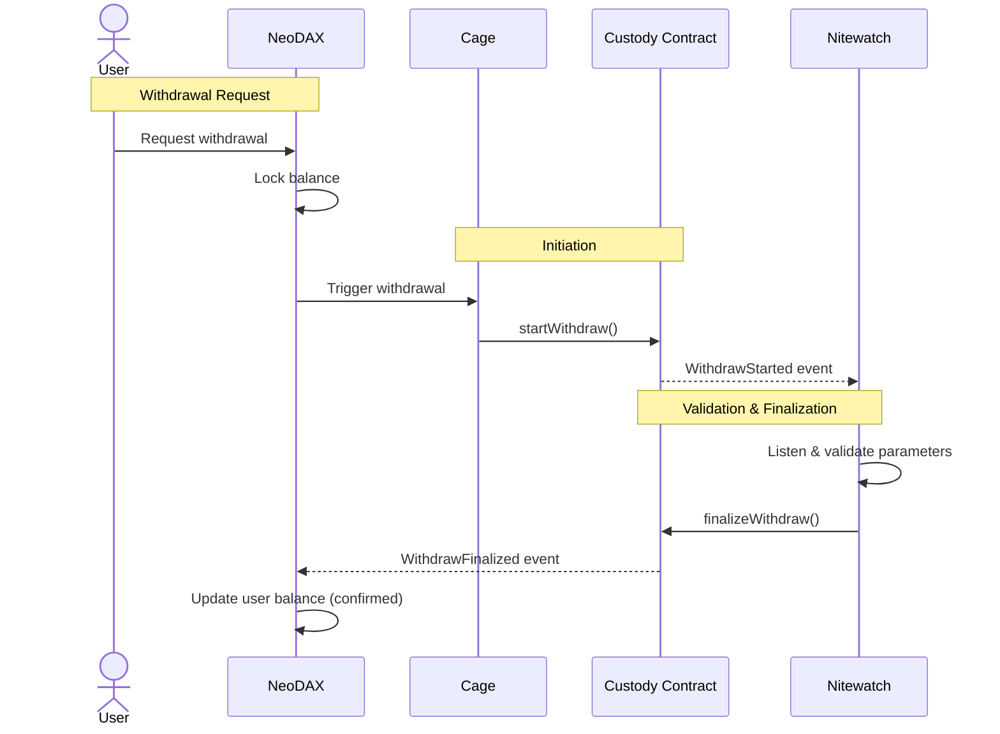

# NeoDAX Gateway

NeoDAX Gateway is a micro-service interacting with an EVM on-chain custody contract through the `ICustody` interface. Users can deposit and withdraw funds for the Yellow Network.

The custody uses Role-Based Access Control (RBAC) to manage permissions.

## Stack

- **Smart Contracts**: Solidity (Forge)
- **Backend**: Go
- **Blockchain**: EVM-compatible chains (first version)

## Features

### Deposits

Users can deposit from a frontend dApp into the custody contract:

- **ETH** (native)
- **ERC20 tokens**

### Withdrawals

Users can withdraw funds through a two-step process involving two separate micro-services that process the withdrawal request with independent logic:

- **Cage** — Verifies and locks the user balance on the NeoDAX side and initiates the on-chain withdrawal.
- **Nitewatch** — Deployed in a high-security isolated environment. Tracks per-user hourly/daily limits and global hourly/daily limits (a security policy engine).

## Withdrawal Flow

1. User requests a withdrawal on the NeoDAX API.
2. NeoDAX locks the user's balance and **Cage** calls `startWithdraw` on the custody contract.
3. **Nitewatch** listens to the blockchain event `WithdrawStarted` and validates the parameters against security policies.
4. **Nitewatch** calls `finalizeWithdraw` on the contract to complete the transfer.

