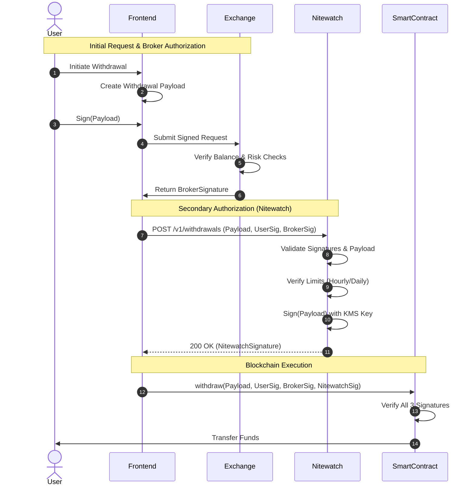

# Nitewatch

Nitewatch is a specialized watchtower microservice designed to provide a secure, secondary authorization layer for cryptocurrency withdrawals from smart-contract custody. Its primary use case is to facilitate secure withdrawals from Centralized Exchange (CEX) or Decentralized Exchange (DEX) trading accounts by acting as an independent arbiter.

## Purpose

Nitewatch acts as a gatekeeper. It validates withdrawal requests against a strict security policy before applying a secondary signature. This signature is required by the custody smart contract to release funds.

**Critical Security Requirement:**
Nitewatch must be deployed in an isolated and highly secure environment. The private key used for the secondary signature **MUST** be stored in a Key Management Service (KMS) for production deployments. The service is designed to be agnostic of other platform components, interacting solely via a simple REST API.

## Security Policy

Before countersigning any withdrawal request, Nitewatch enforces the following logic:

1. **Payload Validation:** Verifies the integrity and authenticity of the withdrawal payload, including:
    * Signatures: Validates the User's signature and the Broker/Exchange's signature.
    * Data: Checks `user_address`, `email` (if provided), `token`, `amount`, `chainId`, and `nonce`.
2. **Rate Limiting & Quotas:** Checks withdrawal limits to prevent draining attacks:
    * User Hourly Limit
    * User Daily Limit
    * Global Hourly Limit
    * Global Daily Limit
3. *(Planned)* **Two-Factor Authentication:** Email OTP (One-Time Password) flow.
4. *(Planned)* **Trade Verification:** Future support for verifying signed orders and counter-signed trades to ensure withdrawals match trading activity.

## User Flow

The withdrawal process involves coordination between the User, the Exchange (Broker), Nitewatch, and the Smart Contract.


```mermaid
sequenceDiagram
    autonumber
    actor User
    participant Frontend
    participant Exchange
    participant Nitewatch
    participant SmartContract

    Note over User, Exchange: Initial Request & Broker Authorization
    User->>Frontend: Initiate Withdrawal
    Frontend->>Frontend: Create Withdrawal Payload
    User->>Frontend: Sign(Payload)
    Frontend->>Exchange: Submit Signed Request
    Exchange->>Exchange: Verify Balance & Risk Checks
    Exchange->>Frontend: Return BrokerSignature

    Note over Frontend, Nitewatch: Secondary Authorization (Nitewatch)
    Frontend->>Nitewatch: POST /v1/withdrawals (Payload, UserSig, BrokerSig)
    Nitewatch->>Nitewatch: Validate Signatures & Payload
    Nitewatch->>Nitewatch: Verify Limits (Hourly/Daily)
    Nitewatch->>Nitewatch: Sign(Payload) with KMS Key
    Nitewatch-->>Frontend: 200 OK (NitewatchSignature)

    Note over Frontend, SmartContract: Blockchain Execution
    Frontend->>SmartContract: withdraw(Payload, UserSig, BrokerSig, NitewatchSig)
    SmartContract->>SmartContract: Verify All 3 Signatures
    SmartContract->>User: Transfer Funds
```

## REST API (Draft)

The following is a draft of the core REST API endpoints provided by Nitewatch.

### 1. Initiate Withdrawal

Submit a pre-signed withdrawal request to Nitewatch. This triggers the validation process and, if successful, returns the Nitewatch signature.

* **Endpoint:** `POST /v1/withdrawals`
* **Request Body:**

    ```json
    {
      "user_address": "0x123...",
      "token_address": "0xabc...",
      "amount": "1000000000000000000",
      "chain_id": 1,
      "nonce": 42,
      "email": "user@example.com",
      "signatures": {
        "user": "0xuser_sig...",
        "broker": "0xbroker_sig..."
      }
    }
    ```

* **Response (200 OK):**

    ```json
    {
      "withdrawal_id": "550e8400-e29b-41d4-a716-446655440000",
      "status": "approved",
      "nitewatch_signature": "0xnitewatch_secure_sig..."
    }
    ```

### 2. Get Withdrawal Status

Check the status of an existing withdrawal request.

* **Endpoint:** `GET /v1/withdrawals/{withdrawal_id}`
* **Response:**

    ```json
    {
      "id": "550e8400-e29b-41d4-a716-446655440000",
      "status": "approved",
      "created_at": "2023-10-27T10:00:00Z"
    }
    ```
