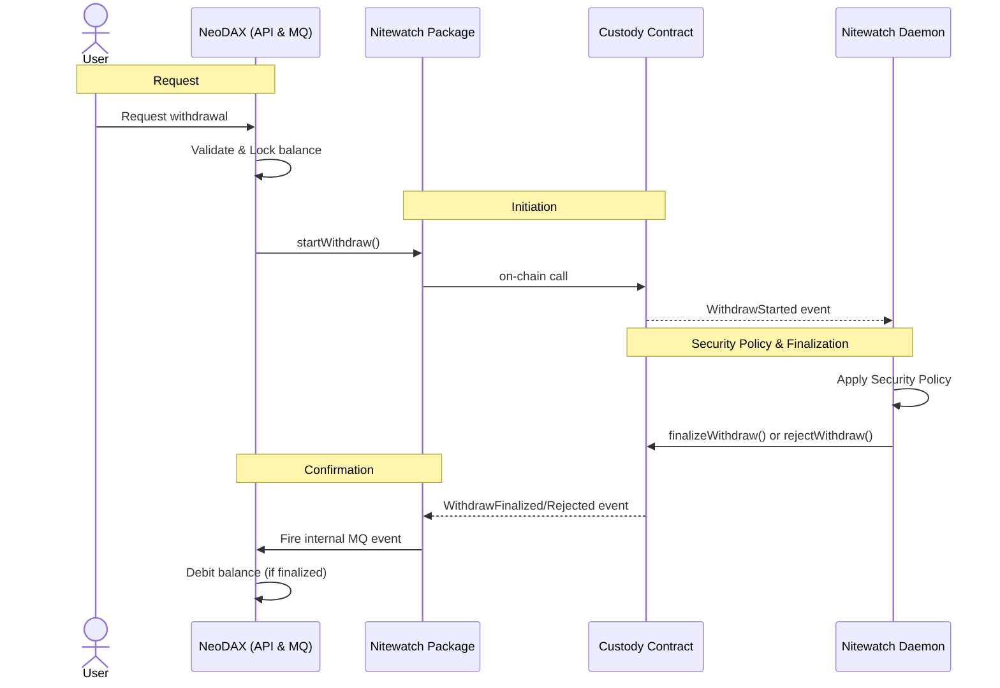

# Nitewatch

Nitewatch is a package used by **NeoDAX** to interact with an EVM on-chain custody contract through the `ICustody` interface. It provides the security policy engine and the infrastructure to manage deposits and withdrawals.

NeoDAX utilizes the Nitewatch package to run two primary processes:

1. **Event Daemon**: Produces `ICustody` events by listening to the blockchain and pushing them to an internal Message Queue (MQ).
2. **Contract Interface**: An implementation to call smart-contract methods (e.g., starting or finalizing withdrawals).

## Stack

- **Smart Contracts**: Solidity (Forge)
- **Backend**: Go
- **Blockchain**: EVM-compatible chains

## Features

### Deposits

1. User deposits native ETH or ERC20 tokens into the custody contract via a frontend dApp.
2. The **Event Daemon** detects the on-chain event.
3. An internal event is fired to the NeoDAX MQ.
4. NeoDAX credits the user's balance.

### Withdrawals

Withdrawals are governed by a security policy engine that tracks per-user and global limits (hourly/daily).

1. User requests a withdrawal via the NeoDAX Web API.
2. NeoDAX validates the request internally and locks the user's balance.
3. NeoDAX uses the Nitewatch package to call `startWithdraw` on the custody contract.
4. The **Nitewatch Daemon** listens for the `WithdrawStarted` event, applies the security policy, and then either calls `finalizeWithdraw` or `rejectWithdraw`.
5. The **Event Daemon** waits for the outcome (`WithdrawFinalized` with `success` being either `true` or `false`), fires an internal event, and NeoDAX debits the balance upon successful confirmation.

## Flows

### Withdrawal Flow

```mermaid
sequenceDiagram
    actor User
    participant NeoDAX as NeoDAX (API & MQ)
    participant NWPkg as Nitewatch Package
    participant Contract as Custody Contract
    participant NWDaemon as Nitewatch Daemon

    Note over User, NeoDAX: Request
    User->>NeoDAX: Request withdrawal
    NeoDAX->>NeoDAX: Validate & Lock balance
    
    Note over NWPkg, Contract: Initiation
    NeoDAX->>NWPkg: startWithdraw()
    NWPkg->>Contract: on-chain call
    Contract-->>NWDaemon: WithdrawStarted event

    Note over NWDaemon, Contract: Security Policy & Finalization
    NWDaemon->>NWDaemon: Apply Security Policy
    NWDaemon->>Contract: finalizeWithdraw() or rejectWithdraw()
    
    Note over NWPkg, NeoDAX: Confirmation
    Contract-->>NWPkg: WithdrawFinalized/Rejected event
    NWPkg->>NeoDAX: Fire internal MQ event
    NeoDAX->>NeoDAX: Debit balance (if finalized)
```

## Important Considerations

### Signer Removal and Front-Running

A signer about to be removed can observe the pending `removeSigners` transaction in the mempool and front-run it by submitting a `finalizeWithdraw` call with higher gas. Because the removal has not yet been executed, the signer remains in the active set and passes the `onlySigner` modifier.

When a pending withdrawal is one approval short of the threshold, this front-run pushes the approval count over, triggering `_executeWithdrawal` and transferring the funds. The `removeSigners` transaction confirms afterward — the signer is removed, but the funds are already gone.

The remaining signers have no way to prevent this during the active withdrawal window. Even if they no longer want the withdrawal to proceed — whether due to changed circumstances, a revised signer configuration, or simply reconsidering the request — `rejectWithdraw` is only callable after `OPERATION_EXPIRY` (1 hour). There is no on-chain cancellation mechanism during the active window.

### Approval Persistence Across Signer Changes

When `_countValidApprovals` checks approvals for a withdrawal, it iterates through all current signers and verifies their approval status in the `withdrawalApprovals` mapping. If a signer is removed via `removeSigners`, their approval record is not cleared from this mapping.

If the same address is later re-added via `addSigners` while a withdrawal is still within its `OPERATION_EXPIRY` window (1 hour), the previous approval remains valid and is counted without requiring the re-added signer to explicitly call `finalizeWithdraw` again.

NOTE: it is unlikely that a signer would be removed and then re-added within the short withdrawal window. Even if it happens, the security policy engine can still reject the withdrawal after `OPERATION_EXPIRY` if needed.

### Off-Chain Balance Accounting

The custody contract does not maintain per-user balance records on-chain. All balance tracking is performed off-chain by NeoDAX based on events emitted by the custody contract (`Deposited`, `WithdrawFinalized`, etc.).

Users cannot query their balances directly from the smart contract and must use the NeoDAX Web API or frontend interface to view their account balances. The on-chain contract functions solely as a vault that responds to deposit and withdrawal operations orchestrated by the off-chain security policy engine.
